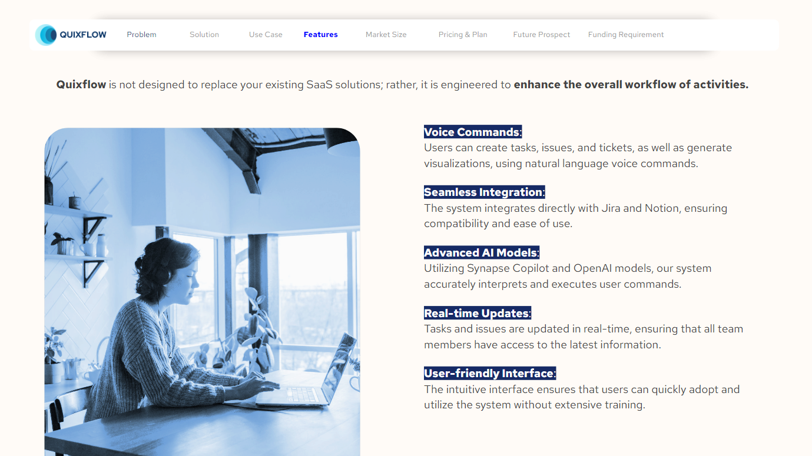
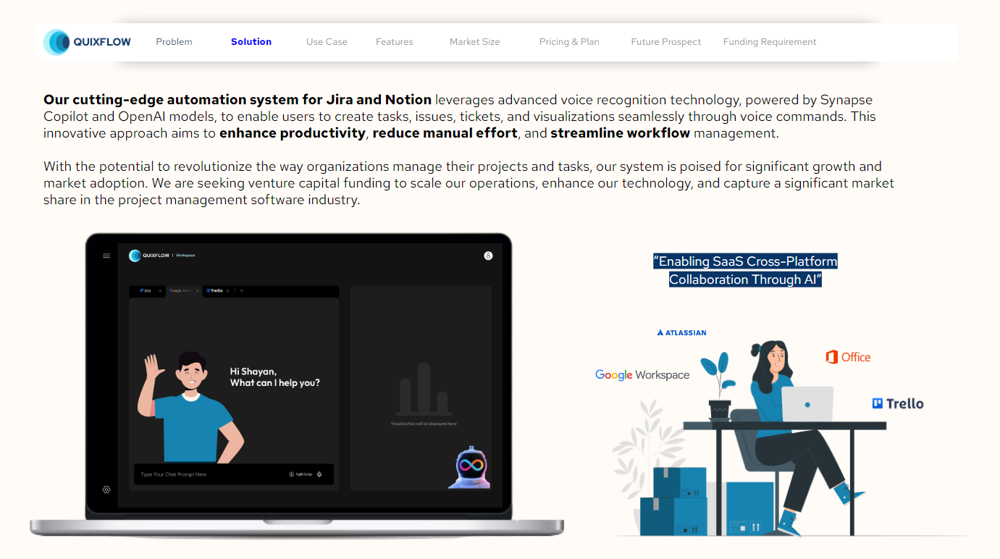

## Quixflow is our initiative to solve the issues that every developer faces while using JIRA.

<h1 align="center">
    <a></a>
</h1>

#### We have come up with the most optimized solutions to all your problems using advanced AI models that make your life easier.

<h1 align="center">
    <a></a>
</h1>

##### **Problems we have solved till yet**

1. Automated ticket creation
2. Automated issue creation
3. Automated task assignment to members
4. Reassign or extension of deadlines
5. Automated Task Generation
6. Smooth Project Workflow and Lifecycle

##### The funfact is all these are done via simple voice commands to our advanced AI model so that you don't have to tire out your fingers by typing.


##### Future prospects:-

<h1 align="center">
    <a></a>
</h1>

#####.

##### Infinity. Many more to go...


### How to Start the Project in your local machine

1. Install node if it's not already installed, via [Node Official Website](https://nodejs.org/en/download/prebuilt-installer) and configure the paths
2. Install Git and Github, if it's not already installed, via [Git](https://git-scm.com/downloadsr) and configure the paths.
3. Clone this repository by running the command

```

git clone https://github.com/r7projects-shayan/agile-loop-hackathon.git
```

##### 4. Navigate to the directory via

```

cd ./agile-loop-hackathon

```

##### 5. Navigate to the frontend code via

```

cd ./frontend

```

##### 6. Install the necessary packages via

```

npm install

```

##### 7. Run the code by

```

npm run dev

```
